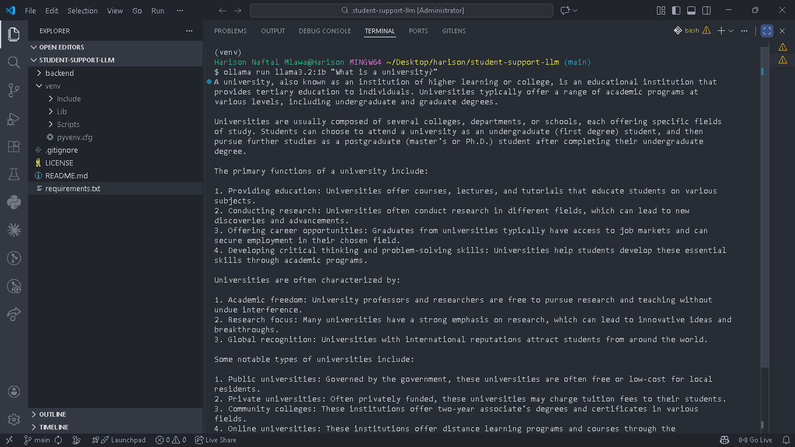
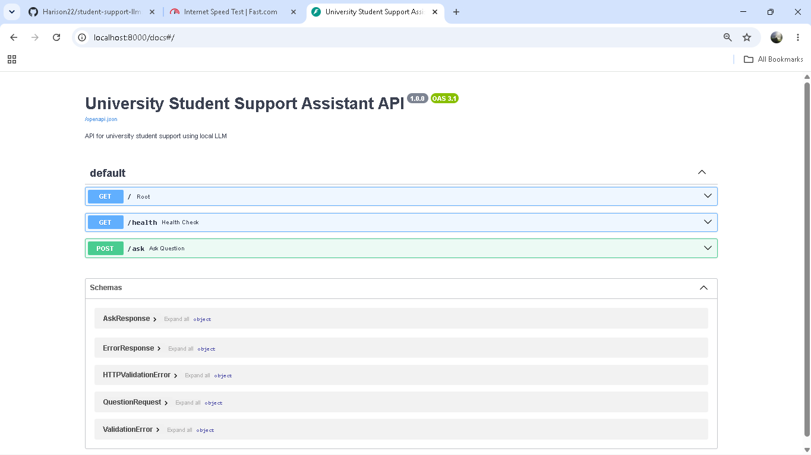
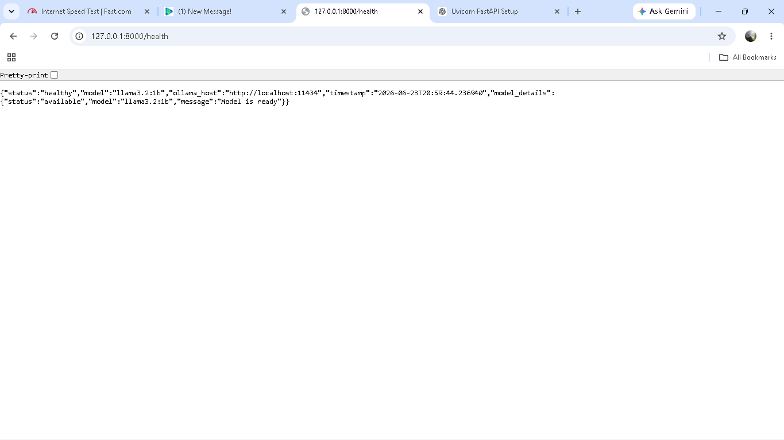

# 🎓 University Student Support Assistant
### An Intelligent, Privacy-First Campus Support System
**Course:** IS365 — Information Systems | **Institution:** University of Dar es Salaam, COICT

---

## 1. Introduction

The **University Student Support Assistant** is a full-stack application pairing a locally-run large language model with a FastAPI backend and a Streamlit chat interface. Built on **FastAPI**, **Streamlit**, and **Ollama** (`llama3.2:1b`), it answers student questions about registration, fees, academics, and campus life without any data leaving the local machine.

The project adds a lightweight **RAG (Retrieval-Augmented Generation)** layer over real UDSM FAQ content across eight service domains, a **pytest suite (12/12 passing)**, and structured logging.

| At a Glance | |
|---|---|
| 🧠 Model | Ollama — `llama3.2:1b` (local inference) |
| ⚙️ Backend | FastAPI + Pydantic validation |
| 🖥️ Frontend | Streamlit chat interface |
| 📚 Knowledge Layer | Keyword-overlap RAG over UDSM FAQ data |
| ✅ Testing | 12/12 pytest cases passing |
| 🔒 Privacy | 100% local — no external API calls |

**Problem:** Students face many recurring, low-complexity questions — fees, deadlines, transcripts — that don't need a human, just a fast, accurate answer.

**Goal:** Accept natural-language questions, ground answers in real UDSM data via RAG, fall back to the LLM when no FAQ match exists, expose a clean REST API, and run entirely offline.

---

## 2. System Use Case

A registered UDSM student needs a fast answer to a routine administrative or academic question, without waiting on staff or searching scattered web pages.

**Student journey:** open the app → type a question → assistant checks the FAQ knowledge base first → if no strong match, the LLM generates a contextual response → answer displayed instantly, with a friendly fallback if the backend is down.

The RAG knowledge base covers eight UDSM service domains:

| Domain | Example Coverage |
|---|---|
| Registration & Admissions | Fees, deadlines, required documents |
| Academics | Exam schedules, GPA policy, repeat courses |
| Finance | Tuition (TZS), payment methods, loans board |
| Accommodation | Hostel fees, application windows |
| ICT Services | Wi-Fi access, student portal, email setup |
| Library | Borrowing rules, e-resources |
| Health Services | Clinic hours, insurance |
| Student Affairs | Clubs, elections, welfare support |

A bonus **Good / Average / Poor** response-quality score gives early insight into where the FAQ dataset or prompts need improvement.


*Streamlit UI*

---

## 3. Tools and Technologies Used

| Layer | Technology | Role |
|---|---|---|
| Language Model | Ollama — `llama3.2:1b` | Local inference, no external calls |
| Backend | FastAPI + Pydantic | Routing, validation, response shaping |
| Frontend | Streamlit | Chat interface |
| Testing | pytest | Automated coverage (12/12 passing) |
| Server | uvicorn | ASGI server for FastAPI |
| Logging | Rotating log handler | Structured, size-bounded logging |

**Prerequisites:** Python 3.10+, [Ollama](https://ollama.com) with `llama3.2:1b` pulled, `uvicorn`.

**Key environment variables:** `MODEL_NAME`, `OLLAMA_HOST`, `OLLAMA_TIMEOUT`, `API_HOST`/`API_PORT`, `LOG_FILE`/`LOG_LEVEL`, `ALLOWED_ORIGINS`.

---

## 4. System Architecture

| Component | File | Responsibility |
|---|---|---|
| **API Server** | `backend/main.py` | Routes, CORS, logging, lifecycle hooks |
| **LLM Client** | `backend/llm_client.py` | Talks to Ollama, handles timeouts & errors |
| **RAG Engine** | `backend/rag.py` | Matches queries against FAQ knowledge base |
| **Configuration** | `backend/config.py` | Centralized env-based settings |
| **Frontend** | `frontend/app.py` | Streamlit chat UI, posts to `/ask` |
| **Test Suite** | `tests/` | 12 pytest cases covering endpoints & edge cases |

**API Endpoints:**

| Method | Route | Purpose |
|---|---|---|
| `GET` | `/` | API metadata & version info |
| `GET` | `/health` | Backend + Ollama availability check |
| `POST` | `/ask` | Accepts a question, returns a grounded or generated answer |


*Health check JSON response*

---

## 5. Implementation Steps

**Validation & reliability:** Pydantic models (`QuestionRequest`, `AskResponse`, `ErrorResponse`) enforce length limits and consistent shapes; a rotating log handler prevents unbounded log growth; connection errors, timeouts, and empty inputs return structured error messages instead of stack traces.

**RAG layer:** a keyword-overlap retriever checks each question against the curated UDSM FAQ dataset before falling back to the LLM — factual, pricing-sensitive answers come from verified data, while the LLM handles conversational nuance.

**Ollama integration:** `_check_availability()` pings `/api/tags` before serving requests; `generate_response()` posts to `/api/generate` with dedicated handling for timeouts, refusals, and unexpected exceptions.

**Frontend:** built with Streamlit — a single input field and button, real-time error banners if the backend is unreachable, and a response area that distinguishes RAG-sourced from LLM-generated answers.

**Quick start:**

```bash
ollama run llama3.2:1b          # 1. start Ollama
python backend/main.py          # 2. launch backend
streamlit run frontend/app.py   # 3. launch frontend
```


*Swagger `/docs` UI*

---

## 6. Testing and Results

**API testing (Swagger `/docs`):**

| Test | Expected Result | Status |
|------|-----------------|--------|
| `/health` | Returns backend and model status | ✅ Pass |
| `/ask` (valid) | Returns AI response | ✅ Pass |
| `/ask` (empty) | HTTP 422 validation error | ✅ Pass |
| `/feedback` (valid) | Feedback saved | ✅ Pass |
| `/feedback` (invalid) | HTTP 422 validation error | ✅ Pass |

**Manual end-to-end testing:**

| Test Scenario | Expected Result | Status |
|--------------|-----------------|--------|
| Valid question | AI returns relevant answer | ✅ Pass |
| Backend stopped | Frontend shows connection error | ✅ Pass |
| Ollama stopped | Backend returns 503 | ✅ Pass |
| Empty question | Frontend requests input | ✅ Pass |
| Slow response | Loading spinner displayed | ✅ Pass |

**Prompt improvement** — original prompt: `Answer this university question: {question}`. For *"What's the deadline to pay my tuition fees this semester?"*, the original prompt caused the model to invent a deadline; the improved prompt makes it explain that it doesn't know the official deadline and directs the student to the Finance Office, reducing hallucinations.


---

## 7. Challenges Encountered

- Initial model loading caused slower first responses.
- Distinguishing backend failures from model failures required custom exception handling.
- The small Llama 3.2 1B model sometimes produced less accurate responses.
- Backend and frontend configuration was synchronized via a shared `.env` file.

---

## 8. Production Readiness Discussion

This is a deliberately scoped **prototype**. Moving to production would require:

- **Auth** — API keys or institutional SSO instead of open CORS.
- **Rate limiting** — preventing model-server overload.
- **Centralized monitoring** — log aggregation/alerting (e.g. Prometheus/Grafana) instead of a local file.
- **Horizontal scalability** — load balancing or GPU-backed inference beyond a single CPU Ollama instance.
- **Data governance** — a clear policy on retaining, anonymizing, or purging student questions.
- **CI/CD & containerization** — Dockerized, automated test/deploy pipeline.
- **Model evaluation pipeline** — systematic, repeatable answer-quality evaluation before shipping changes.

---

## 9. Conclusion

This project delivers a complete, working pipeline for a self-hosted LLM application: a local development environment, a locally served model, a typed and validated FastAPI backend, an interactive Streamlit frontend, structured logging, comprehensive error handling, an automated test suite, and a bonus response-evaluation feature. Every required architectural component — frontend, backend, local LLM, configuration, logging, error handling, and testing — is present, functional, and documented.

The project's central lesson: building an LLM-powered application is overwhelmingly an exercise in **software engineering** around the model — validation, failure isolation, observability, documentation — rather than in the model itself. The model is a single, swappable component in a larger, carefully engineered system.

---

## 10. Appendix: Screenshots and Code Snippets

**Project structure:**

```
student-support-llm/
├── backend/ (main.py, llm_client.py, config.py)
├── frontend/app.py
├── tests/test_*.py          (12/12 passing)
├── requirements.txt
└── test_ollama.py
```

**Screenshots index:**

| Figure | Description |
|---|---|
| T1.1-1.png | Development environment / workspace |
| T3.1-2.png | Server/terminal output |
| T3.2-1.png | Health check JSON response |
| T3.3-1.png | Swagger `/docs` UI |
| T3.3-4-1.png | Backend logs / traces |
| T2.2-1.png | Streamlit UI |
| T2.3-2.png | LLM fallback response |
| docs/screenshots/swagger-api-test.png | Swagger API testing |
| docs/screenshots/backend-error.png | Backend connection error |
| docs/screenshots/model-error.png | Model unavailable error |
| docs/screenshots/empty-question.png | Empty question validation |
| docs/screenshots/loading-spinner.png | Loading spinner |

**Original prompt (pre-improvement):**

```text
Answer this university question: {question}
```

---

<div align="center">

*Report prepared for IS365 — University Student Support Assistant*
*University of Dar es Salaam · College of Information and Communication Technologies*

</div>