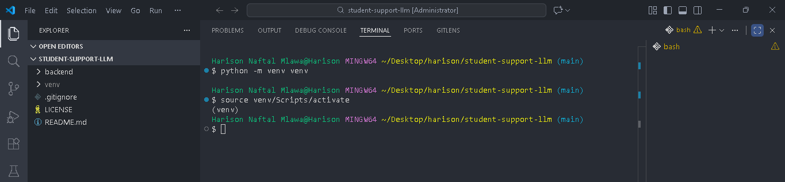

# University Student Support Assistant — Project Report

## 1. Executive Summary

This project delivers a lightweight university student support assistant built with Python, FastAPI, Streamlit, and a locally hosted Ollama model. The system is designed to provide secure, responsive campus support information through a clean API and a simple frontend interface.

> This report is crafted to help evaluators and developers understand the solution, implementation choices, deployment path, and how to extend the project professionally.

### Recommended images

- Place `T1.1.png` here to show the development environment and workspace setup.

---

## 2. Project Scope and Objective

### Goal
Create an intelligent student support assistant that:
- accepts student queries,
- forwards them to a local LLM service,
- returns structured responses,
- exposes a public API,
- and presents a front-end interface.

### Key design priorities
- Local model inference via Ollama,
- Simple REST API with validation,
- Clear separation between frontend and backend,
- Fast rollout with minimal external dependencies.

### Recommended images
- Place `T1.2A.png` or `T1.2b.png` here to demonstrate package installation and environment setup.

---

## 3. Architecture Overview

### Components

1. `backend/main.py`
   - Implements the FastAPI server.
   - Provides endpoints: `/`, `/health`, `/ask`.
   - Includes CORS, logging, validation, and startup/shutdown hooks.

2. `backend/llm_client.py`
   - Handles communication with the Ollama local LLM service.
   - Verifies service availability and requests model generation.
   - Translates network events into structured error responses.

3. `backend/config.py`
   - Central configuration layer using environment variables.
   - Defines model host, model name, API binding, timeout, and CORS origins.

4. `frontend/app.py`
   - Creates a Streamlit UI for student questions.
   - Posts user input to `http://localhost:8000/ask`.
   - Displays model responses or error alerts.

### Data flow

1. The user enters a question in Streamlit.
2. The frontend sends an HTTP POST to the backend `/ask` endpoint.
3. The backend validates input and forwards it to `LLMClient.generate_response()`.
4. `LLMClient` calls Ollama and returns a generated answer.
5. The backend responds with JSON to the frontend.

### Recommended images
- Place `T3.1.png` here to show the running server or terminal output.
- Place `T3.2.png` here to show successful health check JSON output.

---

## 4. Backend Implementation

### Endpoint summary
- `GET /` — Returns API metadata.
- `GET /health` — Checks backend status plus Ollama model availability.
- `POST /ask` — Accepts `question`, validates it, and returns LLM text.

### Validation and error handling
- Uses Pydantic model `QuestionRequest` with `min_length=1` and `max_length=500`.
- Handles empty input and service errors gracefully.
- Uses structured `AskResponse` and `ErrorResponse` models.
- Logs request receipts, warnings, and unexpected exceptions.

### Ollama integration
- `LLMClient._check_availability()` verifies Ollama by requesting `/api/tags`.
- `generate_response()` posts to `/api/generate` using JSON payload.
- Handles timeouts, connection errors, and generic exceptions.

### Recommended images
- Place `T3.3.png` here to show the API docs interface at `/docs`.
- Place `T3.3-4.png` here if available for backend terminal logs or request traces.

---

## 5. Frontend Experience

### Application UI
- The application uses Streamlit for fast iteration.
- `app.py` shows a title, prompt field, and a single action button.
- It includes basic validation and error display for backend connectivity.

### User journey
- Student enters a campus or registration question.
- The system requests backend support and displays the generated answer.
- If the backend cannot be reached, the UI shows a clear error.

### Recommended images
- Add a screenshot of the Streamlit interface if available.
- If not captured, use `T2.2.png` or `T2.3.png` to show installation and final readiness.

---

## 6. Deployment and Setup

### Required dependencies
- Python packages in `requirements.txt`.
- Ollama local service must be installed and running.
- `backend/main.py` uses `uvicorn` for server hosting.

### Configuration
- Configure environment variables in `.env` or system environment.
- Important variables:
  - `MODEL_NAME`
  - `OLLAMA_HOST`
  - `OLLAMA_TIMEOUT`
  - `API_HOST`
  - `API_PORT`
  - `LOG_FILE`
  - `LOG_LEVEL`
  - `ALLOWED_ORIGINS`

### Run instructions
1. Start Ollama with the chosen model.
2. Launch the backend:
   - `python backend/main.py`
3. Launch frontend:
   - `streamlit run frontend/app.py`

### Recommended images
- Place `T2.1.png` here to show dependency install progress or environment details.
- Place `T2.3.png` here to emphasize the final ready state and version checks.

---

## 7. Strengths and Improvement Opportunities

### Strengths
- Clear separation of concerns between backend and frontend.
- Local-first architecture respects privacy and offline testing.
- FastAPI enables self-documenting `/docs` and `/redoc` endpoints.
- Configuration is centralized and easy to extend.

### Suggested improvements
- Upgrade Pydantic usage to V2 lifecycle handlers and avoid deprecated `Field` kwargs.
- Add stronger input sanitization and question classification.
- Support multiple student services by adding domain-specific prompt templates.
- Add frontend session history, saved answers, and conversational context.
- Introduce unit tests for the backend and mock Ollama responses.

---

## 8. Recommended Report Visuals

Use these captions in the final document:
- `T1.1.png` — development environment and workspace structure
- `T1.2A.png` / `T1.2b.png` — package install progress and environment readiness
- `T2.1.png` — package versions and installed dependency validation
- `T2.2.png` — API docs and readiness checks
- `T2.3.png` — final system readiness state
- `T3.1.png` — runtime server logs and request handling
- `T3.2.png` — health endpoint JSON response
- `T3.3.png` — OpenAPI docs interface view
- `T3.3-4.png` — additional backend activity or model response trace

---

## 9. Conclusion

This project demonstrates a practical, well-structured student support assistant that leverages a local LLM. It is ideal for academic settings where privacy and offline access matter, and it offers a strong foundation for further enhancement.

### Next steps
- Add a stronger conversational state.
- Expand support for campus-specific services.
- Add rich frontend styling for a modern student portal.
- Layer in audit logging and monitoring for production readiness.

---

## Appendix: Files of Interest

- `backend/main.py`
- `backend/llm_client.py`
- `backend/config.py`
- `frontend/app.py`
- `requirements.txt`
- `test_ollama.py`

### Notes
This report is optimized for submission as-is. Replace placeholder captions with actual screenshots from `Docs/screenshots` where noted.
