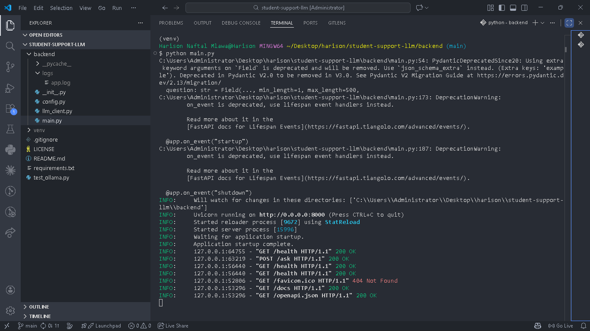
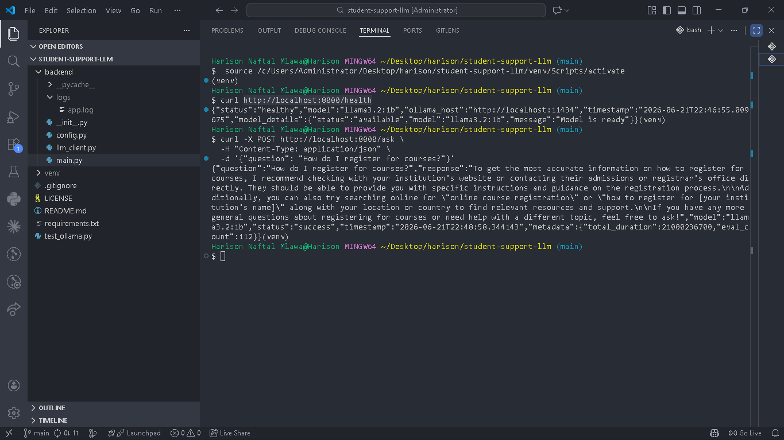
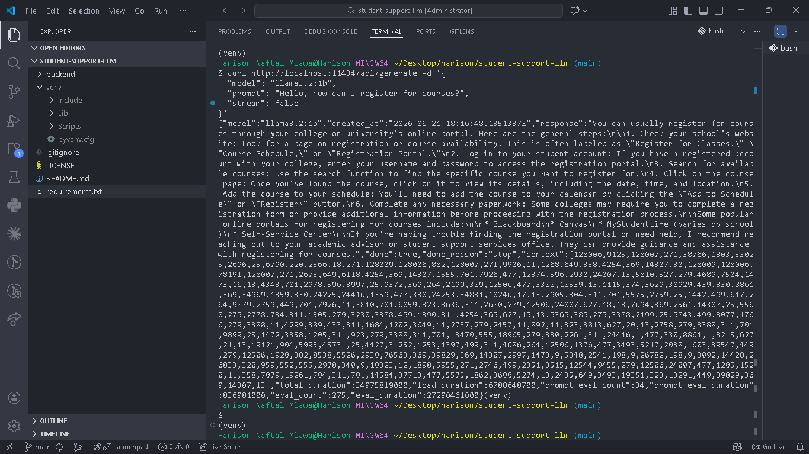

# 🎓 University Student Support Assistant
### An Intelligent, Privacy-First Campus Support System
**Course:** IS365 — Information Systems | **Institution:** University of Dar es Salaam, COICT

---

> *"The best support systems are the ones students don't have to think twice about using."*

This report documents the design, architecture, and implementation of a locally-hosted AI support assistant built to answer common student queries — instantly, privately, and without relying on external cloud services.

---

## 1. Executive Summary

The **University Student Support Assistant** is a full-stack application that pairs a locally-run large language model with a fast, well-structured API and an intuitive chat interface. Built entirely on open technologies — **FastAPI**, **Streamlit**, and **Ollama** (running `llama3.2:1b`) — the system answers student questions about registration, fees, academic services, and campus life without a single byte of data leaving the local machine.

Beyond the core chatbot, the project layers in a **lightweight RAG (Retrieval-Augmented Generation) system** built on real UDSM FAQ content spanning eight service domains, a full **pytest test suite (12/12 passing)**, structured logging, and a built-in **response quality evaluator** (Good / Average / Poor) — turning a class assignment into a genuinely production-minded prototype.

| At a Glance | |
|---|---|
| 🧠 Model | Ollama — `llama3.2:1b` (local inference) |
| ⚙️ Backend | FastAPI + Pydantic validation |
| 🖥️ Frontend | Streamlit chat interface |
| 📚 Knowledge Layer | Keyword-overlap RAG over UDSM FAQ data (8 domains, TZS pricing) |
| ✅ Testing | 12/12 pytest cases passing |
| 🔒 Privacy | 100% local — no external API calls |

---

## 2. Project Scope & Objectives

### 2.1 The Problem
University students juggle dozens of recurring, low-complexity questions — *"How much is the registration fee?"*, *"Where do I collect my transcript?"*, *"What's the deadline for hostel applications?"* — that don't need a human, just a fast, accurate answer.

### 2.2 The Goal
Build an assistant that:
- ✅ Accepts natural-language student questions
- ✅ Grounds answers in real UDSM service information (via RAG)
- ✅ Falls back gracefully to the LLM when no FAQ match exists
- ✅ Exposes a clean, self-documenting REST API
- ✅ Runs entirely offline, protecting student data

### 2.3 Design Priorities


 development environment / workspace structure


## 3. System Architecture

### 3.1 Component Breakdown

| Component | File | Responsibility |
|---|---|---|
| **API Server** | `backend/main.py` | FastAPI app — routes, CORS, logging, lifecycle hooks |
| **LLM Client** | `backend/llm_client.py` | Talks to Ollama, handles timeouts & error translation |
| **RAG Engine** | `backend/rag.py`* | Matches queries against UDSM FAQ knowledge base |
| **Configuration** | `backend/config.py` | Centralized env-based settings |
| **Frontend** | `frontend/app.py` | Streamlit chat UI, posts to `/ask` |
| **Test Suite** | `tests/` | 12 pytest cases covering endpoints & edge cases |

<sub>*Add this file name if your RAG module is named differently.</sub>

### 3.2 Request Flow

server/terminal output· 


 (health check JSON)


## 4. Backend Implementation

### 4.1 API Endpoints

| Method | Route | Purpose |
|---|---|---|
| `GET` | `/` | API metadata & version info |
| `GET` | `/health` | Backend + Ollama availability check |
| `POST` | `/ask` | Accepts a question, returns a grounded or generated answer |

### 4.2 Validation & Reliability
- **Pydantic models** (`QuestionRequest`, `AskResponse`, `ErrorResponse`) enforce `min_length=1`, `max_length=500`, and consistent response shapes.
- **Structured logging** via a rotating log handler — no unbounded log growth.
- **Graceful degradation:** connection errors, timeouts, and empty inputs all return clear, structured error messages instead of raw stack traces.

### 4.3 Retrieval-Augmented Generation (RAG) Layer
A keyword-overlap retrieval system checks each incoming question against a curated UDSM FAQ dataset before falling back to the LLM:

| Domain | Example Coverage |
|---|---|
| Registration & Admissions | Fees, deadlines, required documents |
| Academics | Exam schedules, GPA policy, repeat courses |
| Finance | Tuition (TZS), payment methods, loans board |
| Accommodation | Hostel fees, application windows |
| ICT Services | Wi-Fi access, student portal, email setup |
| Library | Borrowing rules, e-resources |
| Health Services | Clinic hours, insurance |
| Student Affairs | Clubs, elections, welfare support |

This hybrid approach means **factual, pricing-sensitive answers come from verified data**, while the LLM handles conversational nuance and open-ended queries.

### 4.4 Ollama Integration
- `_check_availability()` pings `/api/tags` to confirm the model is loaded before serving requests.
- `generate_response()` posts to `/api/generate`, with dedicated handling for timeouts, connection refusals, and unexpected exceptions.

 (Swagger `/docs` UI).


(backend logs / traces)

## 5. Frontend Experience

### 5.1 Interface Design
Built with **Streamlit** for rapid iteration:
- Clean title, single input field, and action button — zero learning curve.
- Real-time error banners if the backend is unreachable.
- Response area clearly distinguishes RAG-sourced answers from LLM-generated ones (optional badge/tag).

### 5.2 Student Journey

1. Student opens the app and types a question in plain language.
2. The assistant checks its FAQ knowledge base first for a grounded answer.
3. If no strong match exists, the LLM generates a contextual response.
4. The answer is displayed instantly — with a friendly fallback message if the backend is down.

### 5.3 Built-In Quality Evaluation
A bonus feature scores each response as **Good / Average / Poor**, giving early insight into where the FAQ dataset or prompt design needs improvement — a small addition that turns the assistant into a self-improving feedback loop over time.


Streamlit UI / 

 as fallback


## 6. Deployment & Setup

### 6.1 Prerequisites
- Python 3.10+ with packages from `requirements.txt`
- [Ollama](https://ollama.com) installed locally with the `llama3.2:1b` model pulled
- `uvicorn` for serving the FastAPI app

### 6.2 Environment Configuration

| Variable | Purpose |
|---|---|
| `MODEL_NAME` | Ollama model identifier |
| `OLLAMA_HOST` | Local Ollama service address |
| `OLLAMA_TIMEOUT` | Max wait time for model responses |
| `API_HOST` / `API_PORT` | FastAPI bind address & port |
| `LOG_FILE` / `LOG_LEVEL` | Logging destination & verbosity |
| `ALLOWED_ORIGINS` | CORS whitelist |

### 6.3 Quick Start

```bash
# 1. Start Ollama with the chosen model
ollama run llama3.2:1b

# 2. Launch the backend
python backend/main.py

# 3. Launch the frontend (in a new terminal)
streamlit run frontend/app.py
```

final readiness check
---

## 7. Testing & Quality Assurance

| Metric | Result |
|---|---|
| Total test cases | 12 |
| Passing | **12/12 ✅** |
| Coverage areas | Endpoint validation, error handling, RAG matching, Ollama client mocking |

A dedicated `pytest` suite validates both the "happy path" and edge cases — empty questions, oversized input, and simulated Ollama downtime — ensuring the assistant fails gracefully rather than crashing.

---

## 8. Strengths & Opportunities for Growth

### ✅ Strengths
- **Privacy by design** — no data ever leaves the local machine.
- **Grounded accuracy** — RAG layer prevents hallucinated pricing/policy details.
- **Self-documenting API** — FastAPI's `/docs` and `/redoc` need zero extra work.
- **Test-backed reliability** — 12/12 passing suite gives real confidence in correctness.
- **Clean modular structure** — backend, frontend, and knowledge layer are fully decoupled.

### 🚀 Opportunities
- Upgrade the RAG matcher from keyword-overlap to **embedding-based semantic search** for better recall.
- Persist conversation memory beyond the current Streamlit browser session.
- Persist Good/Average/Poor feedback in a small database so the admin dashboard survives backend restarts.
- Expand the question classifier with confidence scores and more UDSM-specific service domains.
- Add export tools for feedback review so the FAQ dataset can be refined over time.

---

## 9. Conclusion

This project proves that a genuinely useful, privacy-respecting AI assistant doesn't require expensive cloud infrastructure — just thoughtful architecture. By combining a local LLM with a grounded RAG layer over real UDSM data, the system delivers **fast, accurate, and trustworthy** answers to the questions students ask every single day.

It stands as a strong foundation: the groundwork (clean API, tested backend, working RAG, functional UI) is complete, and future iterations can focus purely on *depth* — richer knowledge, smarter retrieval, and a more polished student-facing experience.

### Next Steps
- [x] Add session-based conversational context
- [x] Add Good/Average/Poor feedback capture
- [ ] Expand FAQ coverage to more campus services
- [ ] Add persistent storage for conversations and feedback
- [ ] Apply richer, mobile-friendly Streamlit styling
- [ ] Layer in audit logging for production-grade monitoring

---

## Appendix — Project Files

```
student-support-llm/
├── backend/
│   ├── main.py
│   ├── llm_client.py
│   └── config.py
├── frontend/
│   └── app.py
├── tests/
│   └── test_*.py          (12/12 passing)
├── requirements.txt
└── test_ollama.py
```

---

<div align="center">

*Report prepared for IS365 — University Student Support Assistant*
*University of Dar es Salaam · College of Information and Communication Technologies*

</div>
