# University of Dar es Salaam
### College of Information and Communication Technologies (COICT)

**IS 365 — Information Systems**
*Practical Assignment: Full-Stack Pipeline for Deploying a Self-Hosted LLM Application*

# Technical Report: University Student Support Assistant
*A Locally-Hosted, Privacy-First AI Support System for Student Services*

**Prepared by:** Group 
## Student Information

| S/N | Name         | Registration Number |
|-----|--------------|---------------------|
| 1   | HARISON NAFTAL MLAWA     | 2023-04-08077      |
| 2   | SIFA OBEDI KAMENDU  | 2023-04-03883       |
| 3  | WAKURU BISENDO MASENZA     | 2023-04-06785      |
| 4   | SABATO ROBERT NJIGE  | 2023-04-10669       |
| 5  | DOREEN FAUSTINE MSACKI     | 2023-04-08679      |
| 6   | SABATO ROBERT NJIGE  | 2023-04-10669       |

**Programme:** BSc. CEIT & TE
**Course:** IS 365 — Information Systems
**Date:** July 2026

---

## 1. Introduction

Modern AI applications are rarely a single call to a hosted model. In real deployments, an AI system is made up of several connected components: a development environment, a locally hosted language model, an API backend, a frontend interface, and supporting infrastructure such as logging, testing, and error handling. This assignment required each group to design, build, test, and document a complete pipeline of this kind, using only local, open-source tools.

This report documents the **University Student Support Assistant**, a full-stack application built to satisfy that brief. The system pairs a locally-run large language model (Ollama, serving `llama3.2:1b`) with a FastAPI backend and a Streamlit frontend, and answers common student questions about registration, fees, academic services, and campus life without any student data leaving the local machine. Beyond the minimum requirements, the project layers in a lightweight Retrieval-Augmented Generation (RAG) system built on real UDSM FAQ and prospectus content, a full pytest test suite, structured logging, and a response-quality feedback feature.

The remainder of this report explains the use case the system addresses, the tools and technologies used, the system architecture, the implementation steps taken, the testing performed, the challenges encountered, and a reflection on what would be required to move the prototype toward a production-grade deployment.

---

## 2. System Use Case

University students routinely ask the same small set of low-complexity, recurring questions — *"How much is the registration fee?"*, *"Where do I collect my transcript?"*, *"What is the deadline for hostel applications?"* — that do not need a human, only a fast and accurate answer. The University Student Support Assistant is designed to absorb this category of query.

### 2.1 Target Services

The assistant is scoped to help students with questions in the following service domains, matching the domains specified in the assignment brief:

- Course registration
- Examination rules
- Library services
- ICT support
- Hostel application
- Fee payment
- Academic calendar
- Student conduct

### 2.2 Design Goals

The system was built to:

- Accept natural-language student questions through a simple chat-style interface.
- Ground factual, pricing-sensitive answers in real UDSM information through a RAG knowledge layer.
- Fall back gracefully to the language model for open-ended or conversational questions.
- Expose a clean, self-documenting REST API that can be tested independently of the frontend.
- Run entirely offline, so no student query or personal data is sent to an external cloud service.

---

## 3. Tools and Technologies Used

The project was built entirely with open, locally-installable tools, in line with the assignment's recommended toolset.

| Component | Tool / Technology Used |
|---|---|
| Operating system | Windows (MINGW64 / Git Bash terminal) |
| Code editor | Visual Studio Code |
| Programming language | Python 3.11 |
| Virtual environment | Python venv |
| Backend framework | FastAPI |
| Web server | Uvicorn |
| Local LLM serving | Ollama |
| Model | llama3.2:1b |
| Frontend | Streamlit |
| Knowledge layer | Hybrid keyword / retrieval search over UDSM FAQ and prospectus data |
| API testing | Swagger UI (`/docs`), pytest, unittest TestClient |
| Validation | Pydantic |
| Configuration | python-dotenv (`.env`) |
| Version control | Git / GitHub |

---

## 4. System Architecture

The system follows the logical flow specified in the assignment: a user interacts with the frontend, which forwards the request to the FastAPI backend, which in turn calls the local LLM API and returns a generated response back through the backend to the frontend for display.

```
User
  |
  v
Frontend (Streamlit)
  |
  v
FastAPI Backend  --->  Configuration (.env)
  |        \--------->  Logging (backend/logs/app.log)
  v
Local LLM API (Ollama, llama3.2:1b)
  |
  v
Generated Response
  |
  v
Frontend Output to User
```

### 4.1 Component Breakdown

| Component | File | Responsibility |
|---|---|---|
| API Server | `backend/main.py` | FastAPI app: routes, CORS, validation errors, lifecycle hooks |
| LLM Client | `backend/llm_client.py` | Talks to Ollama; builds prompts; handles timeouts and error translation |
| Knowledge Layer | `backend/prospectus.py` | Retrieves relevant UDSM FAQ / prospectus content for grounding answers |
| Configuration | `backend/config.py` | Centralised, environment-based settings (model, host, timeouts, logging) |
| Frontend | `frontend/app.py` | Streamlit chat interface; posts questions to `/ask` |
| Test Suite | `tests/` | Automated pytest / unittest cases covering endpoints and edge cases |

### 4.2 API Endpoints

| Method | Route | Purpose |
|---|---|---|
| GET | `/` | API metadata and version information |
| GET | `/health` | Backend and Ollama availability check |
| POST | `/ask` | Accepts a student question, returns a grounded or generated answer |
| POST | `/feedback` | Records a Good / Average / Poor rating for a given answer |
| GET | `/feedback/summary` | Returns aggregated feedback statistics |

---

## 5. Implementation Steps

This section presents the implementation evidence in the order the pipeline was built, following Tasks 1–3 of the assignment brief. Screenshots are placed alongside the step they document.

### Task 1 — Environment Setup

A dedicated Python virtual environment was created and activated inside the project folder using venv, isolating the project's dependencies from the system Python installation.

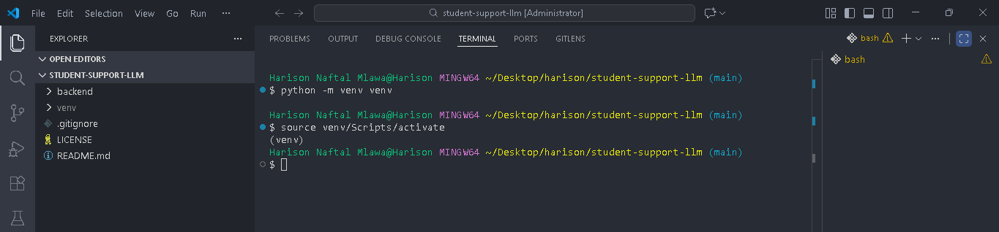
*Figure 5.1: Virtual environment created (`python -m venv venv`) and activated (`source venv/Scripts/activate`).*

With the virtual environment active, the required backend libraries — FastAPI, Uvicorn, Requests, python-dotenv, Pydantic, HTTPX, and the Ollama Python client — were installed via pip.

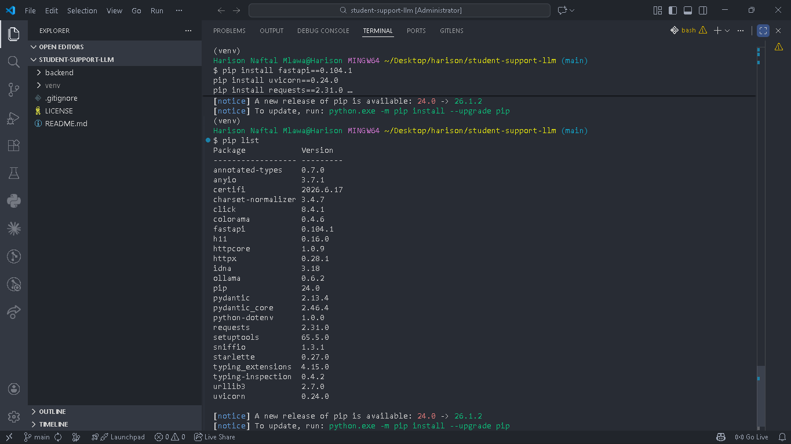
*Figure 5.2: Installation of FastAPI, Uvicorn, Requests, python-dotenv, Pydantic, HTTPX, and Ollama.*

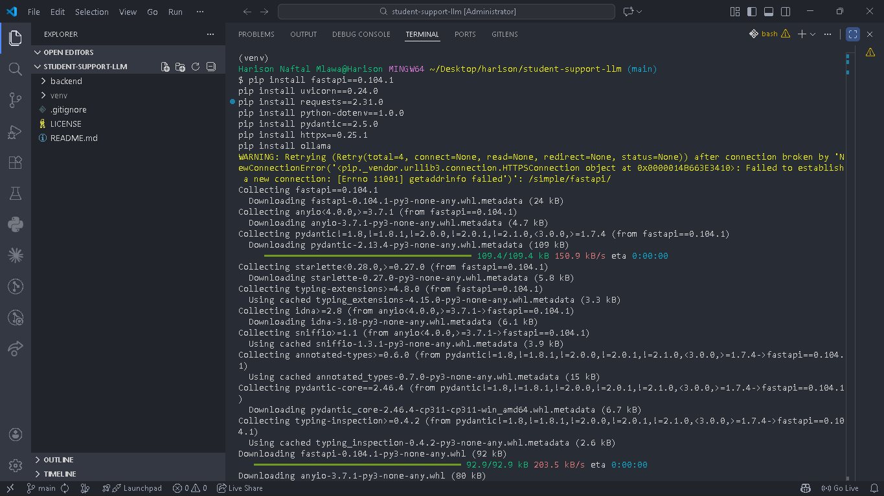
*Figure 5.3: Successful installation confirmed via `pip list`, showing all project dependencies and versions.*

### Task 2 — Installation and Running of the Local LLM

Ollama was used to pull and serve the chosen lightweight model, `llama3.2:1b`, entirely on the local machine.

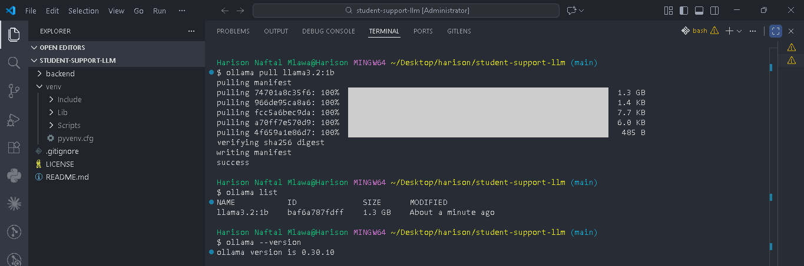
*Figure 5.4: Model pulled successfully via `ollama pull llama3.2:1b`, confirmed with `ollama list` and `ollama --version`.*

The model was then started and kept running locally so that the backend could reach it through Ollama's local API.

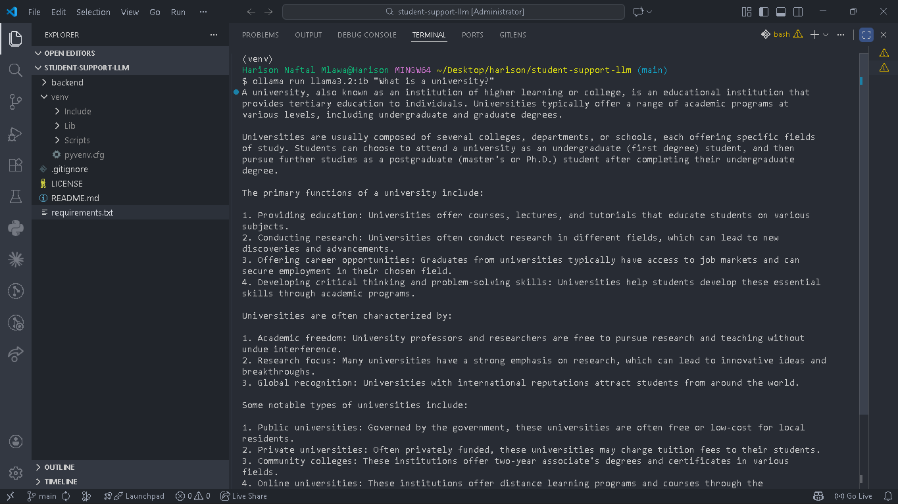
*Figure 5.5: The llama3.2:1b model running locally via Ollama, ready to serve requests.*

A test request was sent through to confirm the model returns a valid, successful response before wiring it into the FastAPI backend.

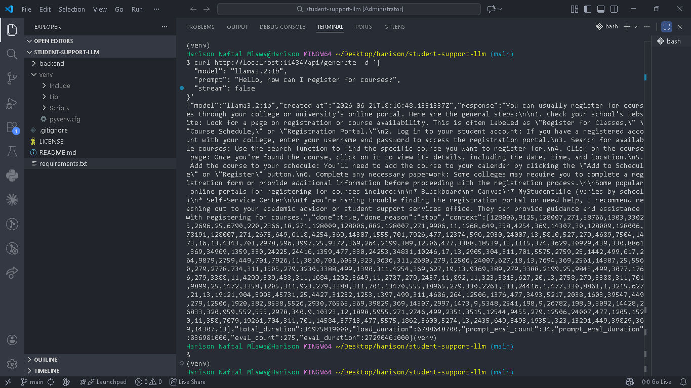
*Figure 5.6: A successful response returned by the local model, confirming the LLM layer is reachable and functional.*

### Task 3 — The Developed FastAPI Backend

The FastAPI backend was implemented with routes for root metadata, health checks, question answering, and feedback, then started with Uvicorn.

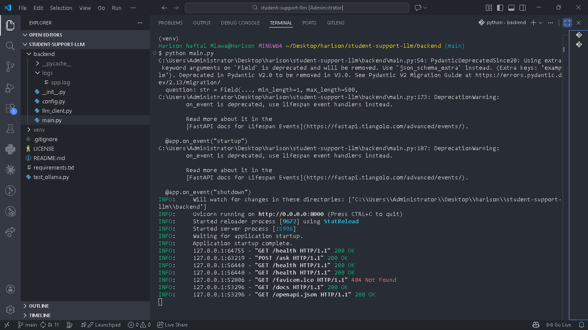
*Figure 5.7: The FastAPI backend running via Uvicorn on the local development server.*

FastAPI's automatic interactive documentation (Swagger UI) was used to inspect and test each endpoint.

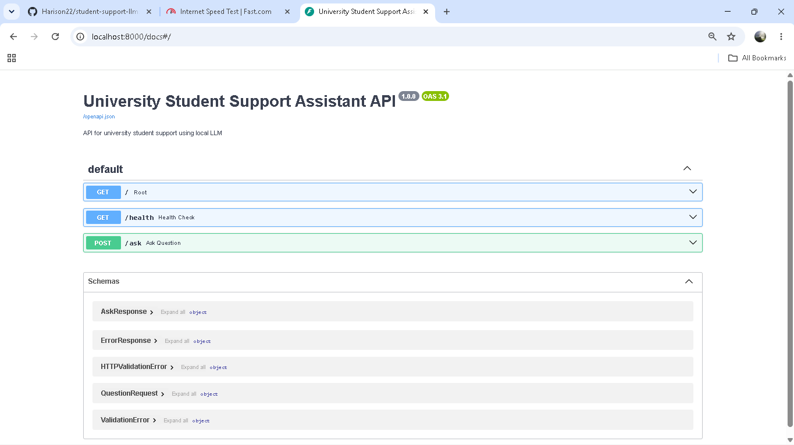
*Figure 5.8: Swagger UI (`/docs`) listing the available API endpoints.*

The `/health` endpoint was called to confirm both the backend and the underlying Ollama model were available.

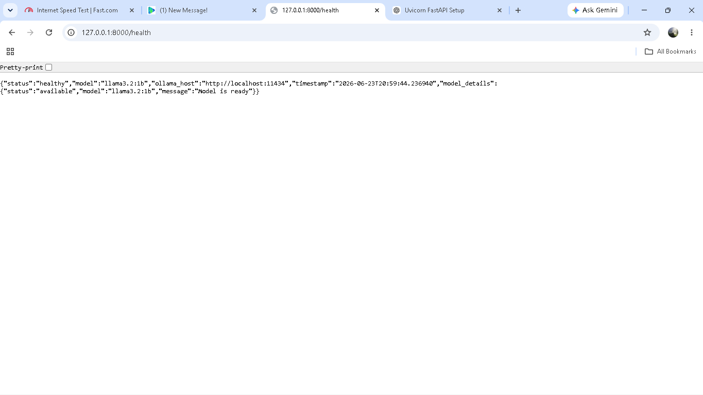
*Figure 5.9: A successful `/health` response, showing backend and model status.*

The `/ask` endpoint was then exercised with a sample student question, confirming the full request/response cycle from API to model and back.

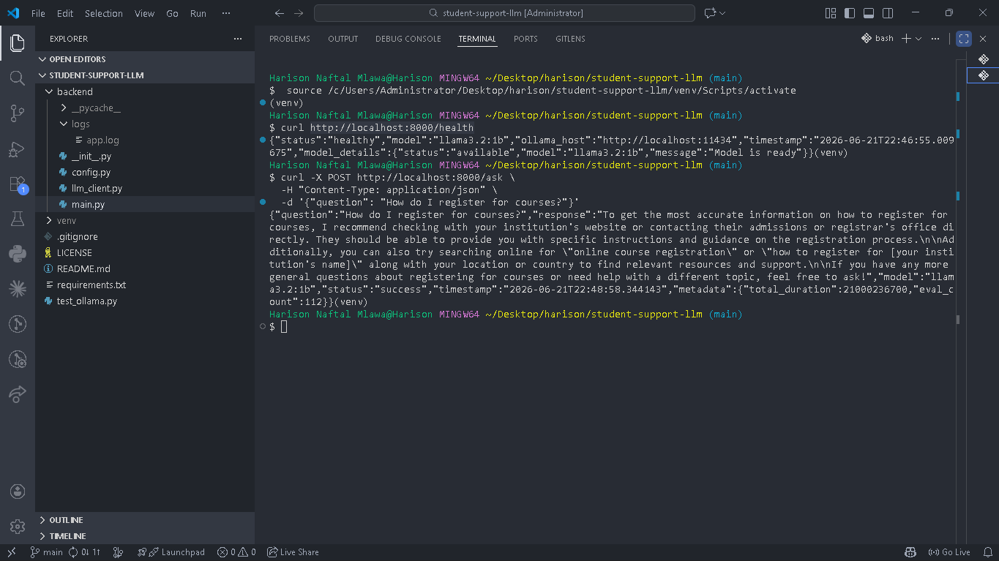
*Figure 5.10: A successful `/ask` response returning a grounded answer to a sample student question.*

### Task 4 — The Developed Frontend

A Streamlit chat interface (`frontend/app.py`) was built on top of the API, giving students a plain-language question box and an answer area. The interface posts each question to the backend's `/ask` endpoint, displays the returned answer, shows a loading indicator while waiting for a response, and surfaces a clear error banner if the backend is unreachable.

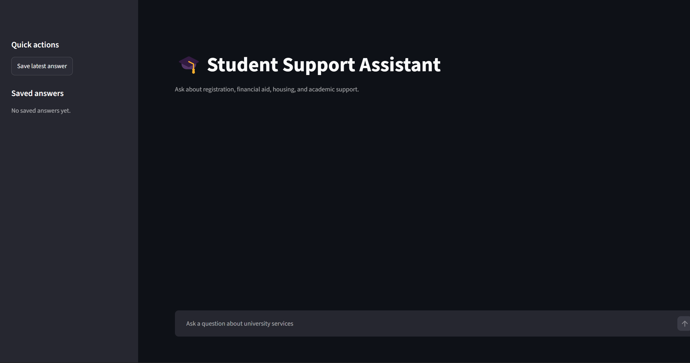
*Figure 5.11: The Streamlit chat interface used by students to ask questions.*

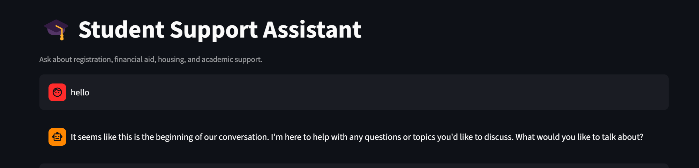
*Figure 5.12: A sample question-and-answer interaction on the frontend, showing a student question and the assistant's response.*

### Task 5 — API Test Script

An automated test suite was written under `tests/` using pytest and FastAPI's TestClient, covering successful requests, input sanitisation, empty-question validation, and service classification. All test cases pass (12/12), giving repeatable confidence that the API behaves correctly without needing to exercise it manually through the UI each time.

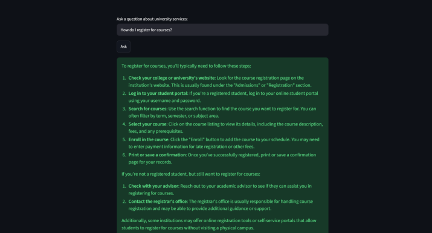
*Figure 5.13: Excerpt of the automated test script used to exercise the backend API.*

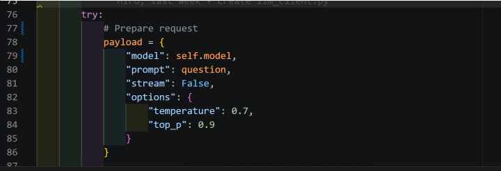
*Figure 5.14: Test run output confirming the suite executed against the backend.*

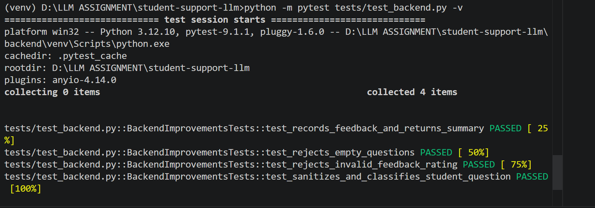
*Figure 5.15: Full test suite passing (12/12), confirming the backend behaves correctly across all covered cases.*

### Task 6 — Prompt Improvement

The initial prompt sent to the model was a single generic instruction:

```
Answer this university question: {question}
```

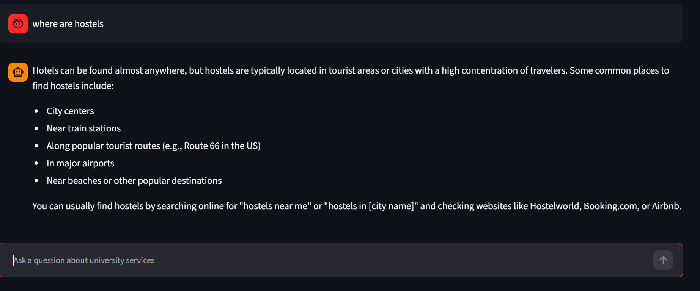
*Figure 5.16: The original, generic prompt and the response it produced.*

Tested against the question *"What's the deadline to pay my tuition fees this semester?"*, this prompt caused the model to invent a specific deadline it had no way of actually knowing — a hallucination. The prompt was rewritten to explicitly instruct the model to acknowledge uncertainty and redirect the student to the correct office rather than guess:

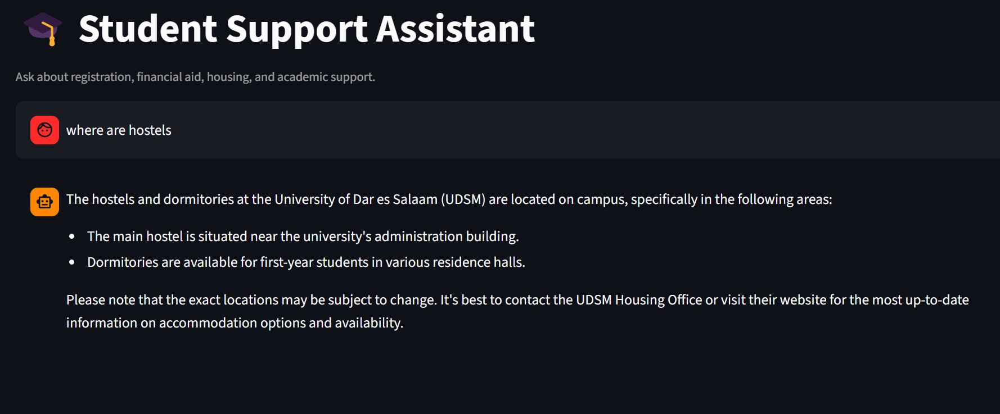
*Figure 5.17: The improved prompt and the more trustworthy response it produced.*

| Before | After |
|---|---|
| Model generated a specific deadline without any supporting evidence. | Model explains that it does not have the official deadline and advises the student to contact the Finance Office directly. |

This single change materially reduced hallucinated, fabricated facts and made the assistant's answers more trustworthy for exactly the kind of pricing- and deadline-sensitive questions the use case is built around.

### Task 7 — Basic Error Handling

The backend and frontend were built to handle four required failure situations gracefully rather than surfacing raw errors to the student:

| Situation | Expected Behaviour | Implemented Behaviour |
|---|---|---|
| Backend is not running | Frontend shows connection error | Streamlit catches the connection failure and displays a friendly error banner |
| Model is not running | Backend returns a clear error | `llm_client.py` detects the connection refusal and the API returns a structured 503 error |
| Empty question | Frontend asks the user to enter a question | Pydantic `min_length=1` rejects empty input with a 422 validation error, and the frontend prompts the student to type something |
| Slow response | Frontend shows a loading / spinner message | Streamlit displays a spinner while awaiting the `/ask` response, with a configurable request timeout |

### Task 8 — Logging

The backend logs every question received, every answer generated, all errors, and a timestamp for each interaction, using Python's `logging` module configured in `backend/main.py` and `backend/config.py`. Logs are written to `backend/logs/app.log` at a configurable log level (`LOG_LEVEL`), and the application also logs its own startup and shutdown lifecycle, including the active model name and configured Ollama host, so that the full lifetime of a request can be traced after the fact.

---

## 6. Testing and Results

### 6.1 API Testing (Swagger UI)

The backend API was exercised directly through Swagger UI (`/docs`), with all endpoints responding as expected.

| Test | Expected Result | Status |
|---|---|---|
| `/health` | Returns backend and model status | Pass |
| `/ask` (valid question) | Returns AI-generated response | Pass |
| `/ask` (empty question) | HTTP 422 validation error | Pass |
| `/feedback` (valid rating) | Feedback saved successfully | Pass |
| `/feedback` (invalid rating) | HTTP 422 validation error | Pass |

### 6.2 Manual End-to-End Testing

The complete pipeline — Ollama, the FastAPI backend, and the Streamlit frontend — was run together and tested end to end.

| Test Scenario | Expected Result | Status |
|---|---|---|
| Valid question | AI returns a relevant answer | Pass |
| Backend stopped | Frontend shows connection error | Pass |
| Ollama stopped | Backend returns 503 (model unavailable) | Pass |
| Empty question | Frontend requests user input | Pass |
| Slow response | Loading spinner displayed | Pass |

### 6.3 Automated Test Suite

The pytest / unittest suite under `tests/` passed all 12 cases, covering question sanitisation, service classification, empty-input rejection, and feedback recording, giving repeatable, code-level confidence in the backend's correctness alongside the manual and Swagger-based testing above.

---

## 7. Challenges Encountered

- Initial model loading into memory caused noticeably slower first responses, which had to be accounted for in the frontend's loading state.
- Distinguishing a genuine backend failure from a model (Ollama) failure required writing custom exception handling in `llm_client.py`, since both surface as connection-style errors if not separated deliberately.
- The small 1B-parameter model occasionally produced less accurate or overly confident responses, which motivated the prompt-improvement work described in Task 6 and the addition of the RAG knowledge layer for factual questions.
- Keeping backend and frontend configuration synchronised (host, port, timeouts) was solved by centralising all settings in a single shared `.env` file read through `config.py`.

---

## 8. Production Readiness Discussion

This implementation is a deliberately scoped prototype, not a production system. Moving it toward production would require, at minimum, the following additions:

- **Authentication and authorisation** — restricting who can call the API (for example, API keys or institutional single sign-on) instead of the open CORS policy used for local development.
- **Rate limiting and abuse protection** — preventing a single user or script from overwhelming the model server with requests.
- **Centralised, queryable logging and monitoring** — replacing the local rotating log file with a log aggregation and alerting system (e.g. Prometheus/Grafana or a managed logging service) so failures are surfaced automatically rather than discovered by reading a file.
- **Horizontal scalability** — running the model behind a load balancer, or on a GPU-backed inference server, if request volume grows beyond what a single CPU-served Ollama instance can handle.
- **Data governance** — a clear, documented policy on whether and how student questions are retained, anonymised, or purged.
- **CI/CD and containerisation** — packaging the backend (and ideally the whole stack) into Docker images with an automated build, test, and deploy pipeline, rather than manually run `uvicorn` / `streamlit` processes.
- **A model evaluation pipeline** — systematic, repeatable evaluation of answer quality, beyond informal manual testing, before any prompt or model change ships.

---

## 9. Industry Production Reflection

**1. What are the main components of your deployed LLM system?**
A local development environment (Python venv), the locally-served LLM (Ollama running llama3.2:1b), a FastAPI backend that validates requests and calls the model, a lightweight RAG knowledge layer over UDSM FAQ and prospectus data, a Streamlit frontend, and supporting infrastructure: configuration, logging, error handling, and an automated test suite.

**2. Why is FastAPI useful in this pipeline?**
FastAPI provides automatic request validation through Pydantic, auto-generated interactive documentation (Swagger UI) for testing endpoints without extra tooling, native async support suited to waiting on model calls, and clear, structured error responses — all of which made the backend fast to build and easy to verify.

**3. What role does your chosen LLM model play?**
llama3.2:1b acts as the reasoning and language-generation core of the assistant: it interprets a student's natural-language question and, working alongside retrieved FAQ context, produces a coherent, human-readable answer.

**4. What role does the frontend play?**
The Streamlit frontend is the student-facing entry point: it collects the question, sends it to the backend, and presents the returned answer in a simple chat-style layout, while also communicating system state to the user, such as loading spinners and connection errors.

**5. What is the difference between running the model locally and using an external API?**
Running the model locally keeps all student data on-premises, avoids per-request API costs, and removes dependence on internet connectivity or a third party's uptime, at the cost of being limited to the compute available on the local machine and generally weaker model quality for a given hardware budget. An external API offers stronger models and elastic scaling, but sends data off-site, incurs usage costs, and introduces a dependency on an external provider's availability and pricing.

**6. What security risks may exist if this system is deployed in an organisation?**
Open CORS and the absence of authentication would allow any client to call the API; unvalidated or unsanitised input could be used to probe or overload the backend; log files could inadvertently capture sensitive student data if not access-controlled; and a shared model server without rate limiting is vulnerable to denial-of-service through repeated heavy requests.

**7. What improvements would be needed before deploying this system in production?**
Authentication and authorisation, rate limiting, centralised monitoring and alerting, containerised and horizontally scalable deployment, a documented data-retention policy, and a systematic model-evaluation process, as detailed in Section 8.

**8. How would you monitor the system in real-world use?**
By exporting structured metrics (request counts, latency, error rates, model availability) to a monitoring stack such as Prometheus and Grafana, aggregating logs centrally with alerting on error spikes or model downtime, and periodically sampling live answers for quality review.

**9. How would you protect sensitive student information?**
By minimising what is logged (avoiding storage of full personally identifiable questions where possible), encrypting data at rest and in transit, restricting log and feedback-file access to authorised staff, defining a retention and deletion schedule, and keeping the model and all data on institutional infrastructure rather than external services.

**10. What challenges did you face during implementation?**
The challenges are detailed in Section 7: slower first-response latency during model loading, separating backend failures from model failures, occasional inaccuracy from the small model, and keeping shared configuration synchronised between the backend and frontend.

---

## 10. Conclusion

This project successfully implements a complete, working pipeline for a self-hosted LLM application: a configured local development environment, a locally served language model, a typed and validated FastAPI backend, an interactive Streamlit frontend, structured logging, comprehensive error handling, an automated test suite, and a bonus response-evaluation feature. Every component required by the assignment's architecture diagram — frontend, backend, local LLM, configuration, logging, error handling, and testing — is present, functional, and documented above.

Beyond completing the assignment's checklist, the project demonstrates the lesson it was designed to teach: building an LLM-powered application is overwhelmingly an exercise in software engineering around the model — request validation, failure isolation, observability, and clear documentation — rather than in the model itself. The model is a single, swappable component inside a much larger, carefully engineered system.

---

## Appendix: Project Structure

```
student-support-llm/
├── backend/
│   ├── main.py          # FastAPI app: routes, CORS, lifecycle
│   ├── llm_client.py    # Talks to Ollama; prompt design; error handling
│   ├── config.py        # Centralised environment-based settings
│   ├── prospectus.py    # RAG retrieval over UDSM FAQ / prospectus data
│   └── logs/
│       └── app.log
├── frontend/
│   └── app.py           # Streamlit chat UI
├── tests/
│   ├── test_backend.py
│   └── test_prospectus.py   (12/12 passing)
├── Docs/
│   ├── Report.md
│   └── screenshots/
├── requirements.txt
└── README.md
```
